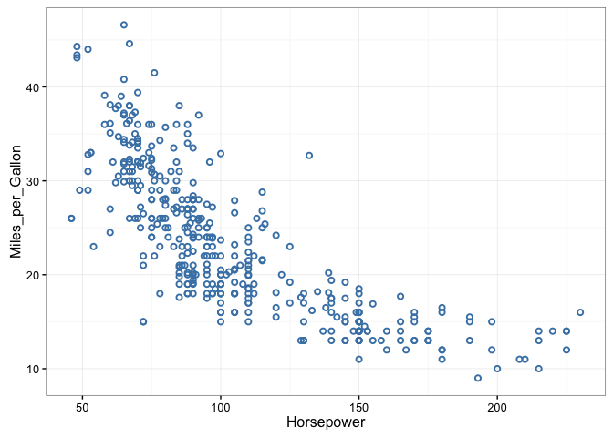
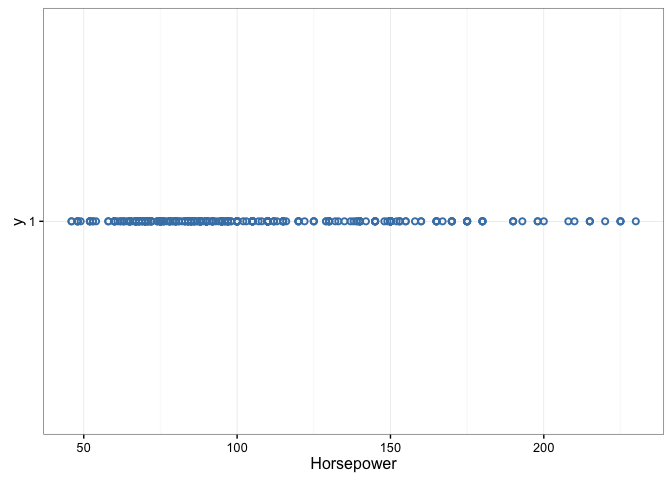
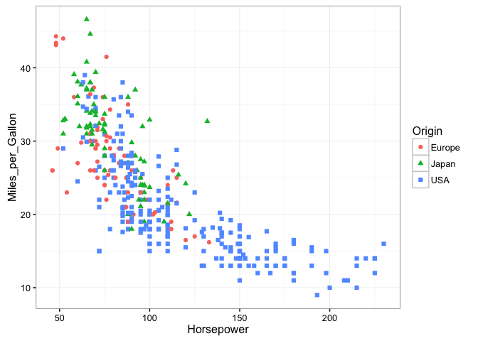
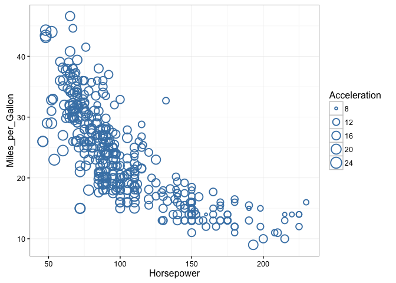
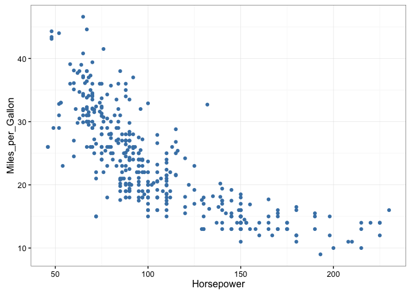
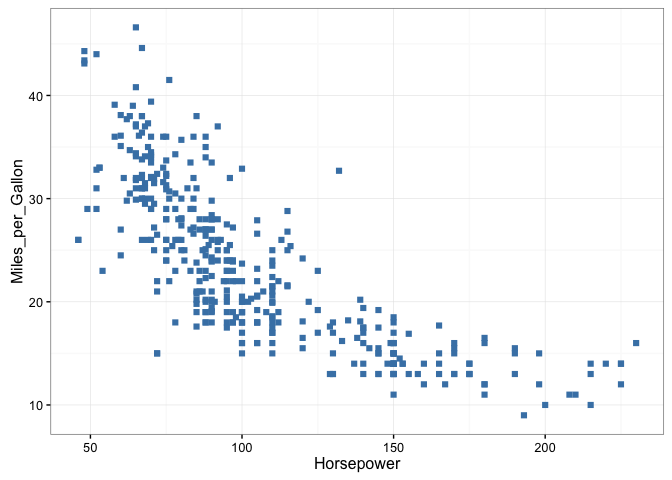
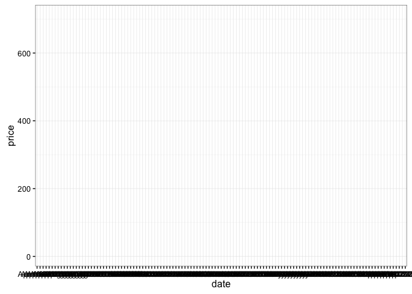

`vegalite` : turn a Vega-Lite spec into a ggplot2 plot (and eventually vice-versa)

The following functions are implemented:

- `ggvega`

### DEVELOPMENT NOTES

Current thinking is to try to use the `vega-lite` node module "headless" and let it do the transforms (et al) then get the spec back into R and convert to ggplot2.

### Installation


```r
devtools::install_github("hrbrmstr/vegalite")
```


### Usage


```r
library(vegalite)

# current verison
packageVersion("vegalite")
```

```
## [1] '0.1.0'
```

### Test Results


```r
library(vegalite)
library(testthat)
library(ggplot2)
library(jsonlite)

for (spec in list.files(system.file("extdata", package="vegalite"), full.names=TRUE)) {
  cat(toJSON(fromJSON(spec), pretty=TRUE))
  print(ggvega(spec))
}
```

```
## {
##   "data": {
##     "values": [
##       {
##         "a": "C",
##         "b": 2
##       },
##       {
##         "a": "C",
##         "b": 7
##       },
##       {
##         "a": "C",
##         "b": 4
##       },
##       {
##         "a": "D",
##         "b": 1
##       },
##       {
##         "a": "D",
##         "b": 2
##       },
##       {
##         "a": "D",
##         "b": 6
##       },
##       {
##         "a": "E",
##         "b": 8
##       },
##       {
##         "a": "E",
##         "b": 4
##       },
##       {
##         "a": "E",
##         "b": 7
##       }
##     ]
##   },
##   "mark": ["point"],
##   "encoding": {
##     "x": {
##       "field": ["a"],
##       "type": ["nominal"]
##     },
##     "y": {
##       "field": ["b"],
##       "type": ["quantitative"]
##     }
##   }
## }
```


```
## {
##   "description": ["A scatterplot showing horsepower and miles per gallons for various cars."],
##   "data": {
##     "url": ["https://vega.github.io/vega-lite/data/cars.json"]
##   },
##   "mark": ["point"],
##   "encoding": {
##     "x": {
##       "field": ["Horsepower"],
##       "type": ["quantitative"]
##     },
##     "y": {
##       "field": ["Miles_per_Gallon"],
##       "type": ["quantitative"]
##     }
##   }
## }
```

```
## Warning: Removed 14 rows containing missing values (geom_point).
```



```
## {
##   "data": {
##     "url": ["https://vega.github.io/vega-lite/data/cars.json"]
##   },
##   "mark": ["point"],
##   "encoding": {
##     "x": {
##       "field": ["Horsepower"],
##       "type": ["quantitative"]
##     }
##   }
## }
```

```
## Warning: Removed 6 rows containing missing values (geom_point).
```



```
## {
##   "description": ["A scatterplot showing horsepower and miles per gallons."],
##   "data": {
##     "url": ["https://vega.github.io/vega-lite/data/cars.json"]
##   },
##   "mark": ["point"],
##   "encoding": {
##     "x": {
##       "field": ["Horsepower"],
##       "type": ["quantitative"]
##     },
##     "y": {
##       "field": ["Miles_per_Gallon"],
##       "type": ["quantitative"]
##     },
##     "color": {
##       "field": ["Origin"],
##       "type": ["nominal"]
##     },
##     "shape": {
##       "field": ["Origin"],
##       "type": ["nominal"]
##     }
##   }
## }
```

```
## Warning: Removed 14 rows containing missing values (geom_point).
```



```
## {
##   "description": ["A bubbleplot showing horsepower on x, miles per gallons on y, and binned acceleration on size."],
##   "data": {
##     "url": ["https://vega.github.io/vega-lite/data/cars.json"]
##   },
##   "mark": ["point"],
##   "encoding": {
##     "x": {
##       "field": ["Horsepower"],
##       "type": ["quantitative"]
##     },
##     "y": {
##       "field": ["Miles_per_Gallon"],
##       "type": ["quantitative"]
##     },
##     "size": {
##       "field": ["Acceleration"],
##       "type": ["quantitative"]
##     }
##   }
## }
```

```
## Warning: Removed 14 rows containing missing values (geom_point).
```



```
## {
##   "data": {
##     "url": ["https://vega.github.io/vega-lite/data/cars.json"]
##   },
##   "mark": ["circle"],
##   "encoding": {
##     "x": {
##       "field": ["Horsepower"],
##       "type": ["quantitative"]
##     },
##     "y": {
##       "field": ["Miles_per_Gallon"],
##       "type": ["quantitative"]
##     }
##   }
## }
```

```
## Warning: Removed 14 rows containing missing values (geom_point).
```



```
## {
##   "data": {
##     "url": ["https://vega.github.io/vega-lite/data/cars.json"]
##   },
##   "mark": ["square"],
##   "encoding": {
##     "x": {
##       "field": ["Horsepower"],
##       "type": ["quantitative"]
##     },
##     "y": {
##       "field": ["Miles_per_Gallon"],
##       "type": ["quantitative"]
##     }
##   }
## }
```

```
## Warning: Removed 14 rows containing missing values (geom_point).
```



```
## {
##   "description": ["Stock prices of 5 Tech Companies Over Time."],
##   "data": {
##     "url": ["https://vega.github.io/vega-lite/data/stocks.csv"],
##     "formatType": ["csv"]
##   },
##   "mark": ["line"],
##   "encoding": {
##     "x": {
##       "field": ["date"],
##       "type": ["temporal"]
##     },
##     "y": {
##       "field": ["price"],
##       "type": ["quantitative"]
##     },
##     "color": {
##       "field": ["symbol"],
##       "type": ["nominal"]
##     }
##   }
## }
```



```r
date()
```

```
## [1] "Tue Feb 23 17:11:15 2016"
```

```r
test_dir("tests/")
```

```
## testthat results ========================================================================================================
## OK: 0 SKIPPED: 0 FAILED: 0
```

