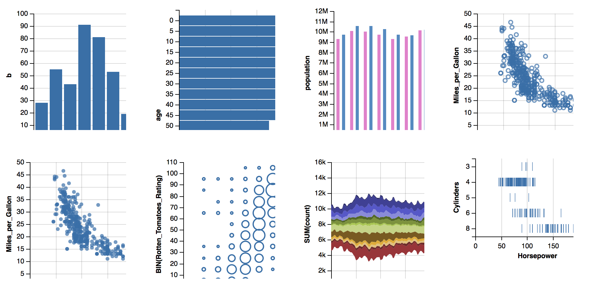
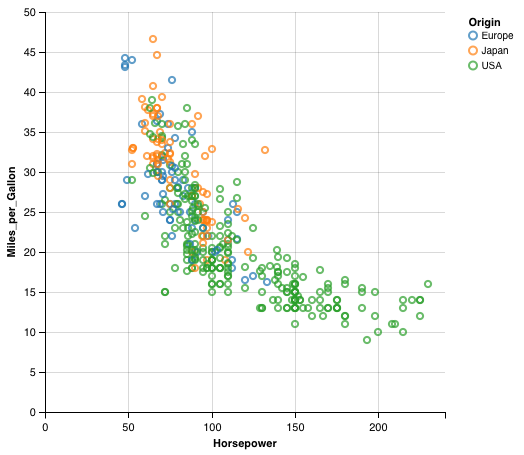

`vegalite` : Do whatever `ggvis` doesn't :-)

For better examples, [take a look here](http://rud.is/projects/vegalite01.html).

There's also a [blog post](http://rud.is/b/2016/02/27/create-vega-lite-specs-widgets-with-the-vegalite-package/) describing this in a bit more detail.

Creation of Vega-Lite spec charts is 98% feature complete. Sorting still
needs to be implementd and many of the parameters to functions are only
documented in TypeScript source code which will take a bit of time to
wade through. All the visualizations you find in the [Vega-Lite Gallery](http://vega.github.io/vega-lite/gallery.html) work
(but the last one just isn't sorted).

Functions also exist which enable creation of widgets from a JSON spec and
turning a `vegalite` package created object into a JSON spec.

You start by calling `vegalite()` which allows you to setup core
configuration options, including whether you want to display links to
show the source and export the visualization. You can also set the background
here and the `viewport_width` and `viewport_height`. Those are
very important as they control the height and width of the widget and also
the overall area for the chart. This does _not_ set the height/width
of the actual chart. That is done with `cell_size()`.

Once you instantiate the widget, you need to `add_data()` which can
be `data.frame`, local CSV, TSV or JSON file (that convert to
`data.frame`s) or a non-realive URL (wich will not be read and
converted but will remain a URL in the Vega-Lite spec.

You then need to `encode_x()` & `encode_y()` variables that
map to columns in the data spec and choose one `mark_...()` to
represent the encoding.

Here's a sample, basic Vega-Lite widget:

    dat <- jsonlite::fromJSON('[
        {"a": "A","b": 28}, {"a": "B","b": 55}, {"a": "C","b": 43},
        {"a": "D","b": 91}, {"a": "E","b": 81}, {"a": "F","b": 53},
        {"a": "G","b": 19}, {"a": "H","b": 87}, {"a": "I","b": 52}
      ]')

    vegalite() %>%
      add_data(dat) %>%
      encode_x("a", "ordinal") %>%
      encode_y("b", "quantitative") %>%
      mark_bar() -> vl

     vl

That is the minimum set of requirements for a basic Vega-Lite spec and
will create a basic widget.

You can also convert that R widget object `to_spec()` which will return
the JSON for the Vega-Lite spec (allowing you to use it outside of R).

    to_spec(vl)

    {
      "description": "",
      "data": {
        "values": [
          { "a": "A", "b": 28 }, { "a": "B", "b": 55 }, { "a": "C", "b": 43 },
          { "a": "D", "b": 91 }, { "a": "E", "b": 81 }, { "a": "F", "b": 53 },
          { "a": "G", "b": 19 }, { "a": "H", "b": 87 }, { "a": "I", "b": 52 }
        ]
      },
      "mark": "bar",
      "encoding": {
        "x": {
          "field": "a",
          "type": "nominal"
        },
        "y": {
          "field": "b",
          "type": "quantitative"
        }
      },
      "config": [],
      "embed": {
        "renderer": "svg",
        "actions": {
          "export": false,
          "source": false,
          "editor": false
        }
      }
    }

If you already have a Vega-Lite JSON spec that has embedded data or a
non-realtive URL, you can create a widget from it via `from_spec()`
by passing in the full JSON spec or a URL to a full JSON spec.

If you're good with HTML (etc) and want a more lightweight embedding options, you
can also use `embed_spec` which will scaffold a minimum `div` +
`script` source and embed a spec from a `vegalite` object.

### Installation


```r
devtools::install_github("hrbrmstr/vegalite")
```


### Usage


```r
library(vegalite)

# current verison
packageVersion("vegalite")
```

```
## [1] '0.3.0.9000'
```


```r
library(vegalite)

vegalite() %>% 
  cell_size(400, 400) %>% 
  add_data("https://vega.github.io/vega-editor/app/data/cars.json") %>% 
  encode_x("Horsepower") %>% 
  encode_y("Miles_per_Gallon") %>% 
  encode_color("Origin", "nominal") %>% 
  mark_point()
```



### Code of Conduct

Please note that this project is released with a [Contributor Code of Conduct](CONDUCT.md). By participating in this project you agree to abide by its terms.

