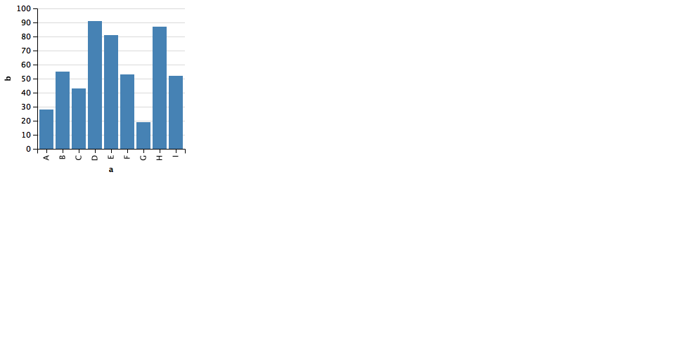

```{r setup, include=FALSE}
knitr::opts_chunk$set(echo = TRUE)
```

```{r}
library(vegalite)

dat <- jsonlite::fromJSON('[
   {"a": "A","b": 28}, {"a": "B","b": 55}, {"a": "C","b": 43},
   {"a": "D","b": 91}, {"a": "E","b": 81}, {"a": "F","b": 53},
   {"a": "G","b": 19}, {"a": "H","b": 87}, {"a": "I","b": 52}
 ]')

vegalite() %>%
  add_data(dat) %>%
  encode_x("a", "ordinal") %>%
  encode_y("b", "quantitative") %>%
  mark_bar() %>% 
  widgetThumbnail("widget.png")
```

